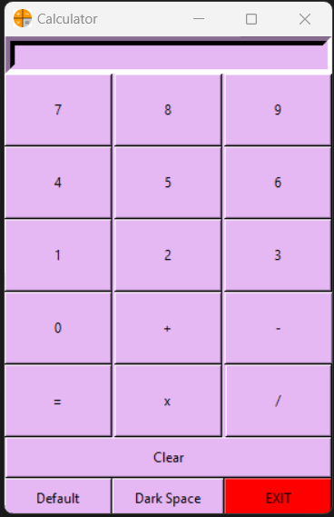
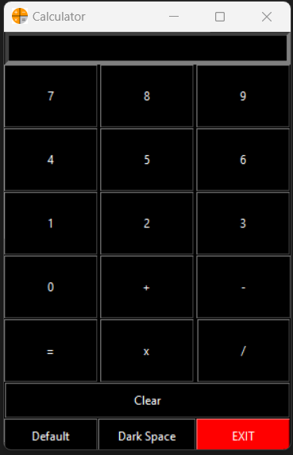

# space-themed-calculator
 Here in this project I've created a simple calculator and worked on different features to provide better user interaction. This simple calculator was created using tkinter and is has a mode feature, using which you can switch to dark mode.

